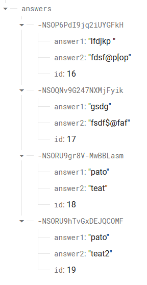
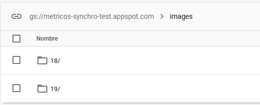

# \<open-wc-test-js>
> Author: Patricio Tena

This code defines a LitElement class called OpenWcTestJs that creates a form with two questions, two text inputs to answer those questions, and an input to upload an image. It uses IndexedDB to store the answers and images locally and Firebase to upload the data to the cloud. The code uses various methods such as __openDatabase(), __saveToIndexedDB(), and __uploadToFirebase() to manage the data storage and retrieval.

# Methods

## Text Input

### __openDatabase()
This function opens a connection to an IndexedDB database with a specified name. If the database does not exist, it creates it and initializes it with an object store that has the number of indexes provided. If the database is successfully opened or created, the code initializes Firebase with a configuration object and stores a reference to the Realtime Database. If there is an error opening the database, an error message is logged to the console.

### __saveToIndexedDB()
This function saves data to the IndexedDB database using the this.db object. It creates a transaction and an object store to handle the data. The data is then added to the object store using the add() method

Data will be saved in the following format:
```json
  {
    answer1: String,
    answer2: String,
    image: Object(Blob())
    id: Number
  }
```

### Image input

### __handleImageUpload()
This function is used to handle an image upload event. When an image is selected, it checks if it is a valid image file and then reads the file using the FileReader API. Once the file is read, it passes the resulting data URL to the second function, __dataUrlToBlob, which converts the data URL to a blob object. The resulting blob object is then assigned to the this.image variable, which can be used to save the image as a blob in local storage or indexedDB.

### __dataUrlToBlob()
This function takes a data URL as input and returns a blob object. It splits the data URL into two parts, the MIME type and the base64-encoded data. It then decodes the base64-encoded data and creates a new Uint8Array from the resulting binary data. Finally, it creates a new Blob object from the Uint8Array and the MIME type, and returns it.

## Firebase
In firbase that will be saved as follows:

- Text will be saved in realtime database:



- Images will be saved in firebase storage in a folder that matches the index of its text inputs:



